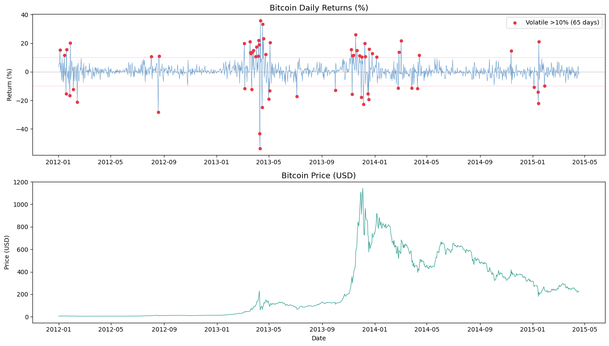

# Crypto Volatility Engine

Bitcoin daily return analysis and market anomaly detection — pure NumPy vectorization, zero for-loops.

## Project Overview

Processes high-frequency Bitcoin market data to analyze historical price volatility.
Transforms 1-minute raw data into daily metrics to detect extreme market swings.

- **Vectorized computation:** Pure NumPy — no Python loops
- **Data resampling:** Pandas groupby to convert 1-min → daily closing prices
- **Anomaly detection:** Flags days with price swings exceeding ±10%

## Key Findings (2012–2015)

- 65 volatile days out of 1,204 trading days
- Worst day: -53.84% (April 11, 2013)
- Best day: +35.81% (April 12, 2013)
- Volatility clusters heavily around the 2013 Bitcoin bubble

## Chart



## Tech Stack

- Python
- NumPy — vectorized calculations
- Pandas — data cleaning and time-series aggregation
- Matplotlib — visualization

## Dataset

Too large for GitHub. Download from Kaggle:
[Bitcoin Historical Data (1-min interval)](https://www.kaggle.com/datasets/mczielinski/bitcoin-historical-data)

## How to Run

```bash
git clone https://github.com/pallabpodderrobin/crypto-volatility-engine.git
cd crypto-volatility-engine
pip install numpy pandas matplotlib
python crypto_volatility.py
```
